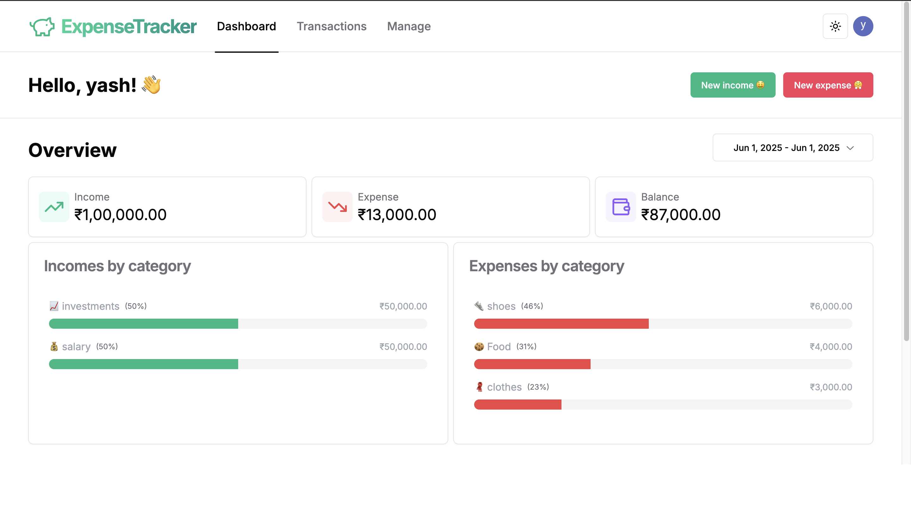

## 🧾 Dashboard Overview

The **Dashboard** gives you a clear and interactive overview of your finances. It helps users track income, expenses, and overall balance in a single glance.

### ✨ Features:
- **Overview Cards**: Quickly view your total **Income**, **Expenses**, and **Balance**.
- **Date Range Selector**: Filter financial data by specific date ranges.
- **Incomes by Category**: Visual representation of income distribution with percentage bars.
- **Expenses by Category**: Breakdown of expenses with colored progress bars for better insight.
- **Transaction History**: Chronological log of all income and expense entries.

The design is fully responsive and optimized for both **light and dark modes**.

### 📸 Dashboard Preview

