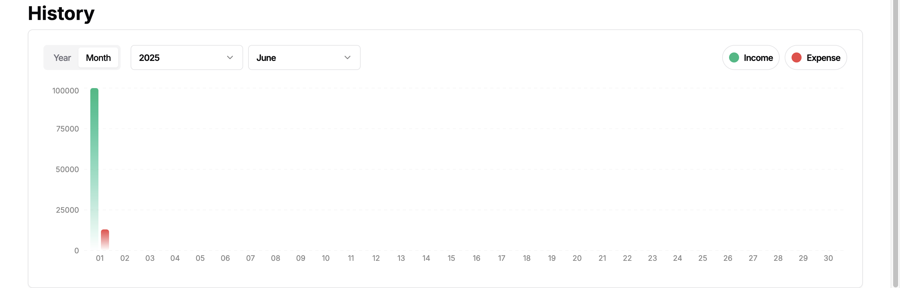
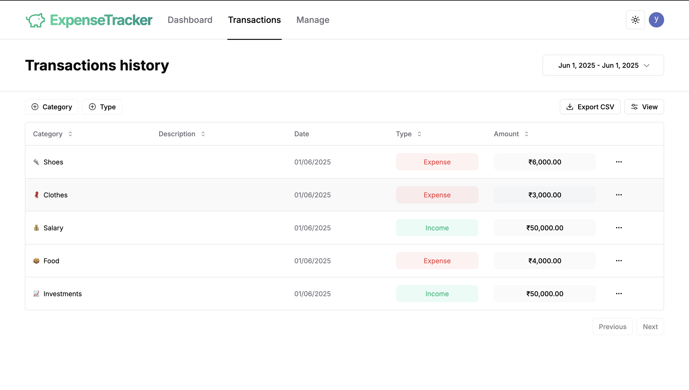
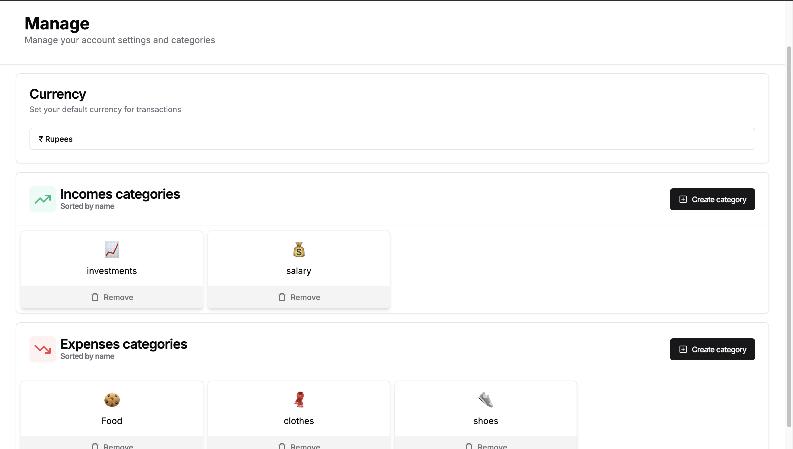

## 🧾 Dashboard Overview

The **Dashboard** gives you a clear and interactive overview of your finances. It helps users track income, expenses, and overall balance in a single glance.

### ✨ Features:
- **Overview Cards**: Quickly view your total **Income**, **Expenses**, and **Balance**.
- **Date Range Selector**: Filter financial data by specific date ranges.
- **Incomes by Category**: Visual representation of income distribution with percentage bars.
- **Expenses by Category**: Breakdown of expenses with colored progress bars for better insight.
- **Transaction History**: Chronological log of all income and expense entries.

The design is fully responsive and optimized for both **light and dark modes**.

### 📸 Dashboard Preview

## 📅 History with Graph

The **History** section provides a detailed and visual representation of all transactions over time.

### 📊 Features:
- **Monthly/Yearly Graphs**: View trends in income and expenses over different months or years.
- **Dynamic Filtering**: Select a specific **month** or **year**, or define a custom **date range** to see relevant transactions.
- **Categorized Summary**: Each data point reflects categorized income and expense, helping you track patterns in financial behavior.
- **Interactive UI**: Smooth, intuitive charts make it easy to compare and analyze financial history at a glance.

This section helps users stay on top of their financial habits and make informed budgeting decisions.

### 📸 History Graph Preview

## 🧾 Detailed Transactions History

The **Transactions** section provides a tabular view of all your financial activities — both incomes and expenses — with clear categorization and filtering options.

### 📌 Key Features:
- **Category & Type Filters**: Instantly filter transactions by category (e.g., food, salary) and type (income or expense).
- **Searchable & Sortable Table**: Sort transactions by date, type, or amount.
- **Date Range Picker**: Choose a custom time range (e.g., `Jun 1, 2025 - Jun 1, 2025`) to filter results accordingly.
- **Export Option**: Download all transactions in **CSV format** for offline tracking and backup.
- **Clean UI**: Distinct visual tags for **Income** (green) and **Expense** (red) for clarity.

This section ensures transparency and gives users full control and visibility over their financial records.

### 🖼️ Transaction Table Preview

## ⚙️ Manage Settings & Categories

The **Manage** section allows users to personalize their expense tracker by configuring the default currency and organizing their transaction categories.

### 🌍 Currency Settings
- Set your **default transaction currency** (e.g., ₹ Rupees) for consistent budgeting across the app.

### 🧩 Custom Categories
Organize your finances better by grouping transactions into meaningful **income** and **expense categories**:
- ✅ **Create new categories** as needed.
- 🗑️ **Remove existing ones** with one click.
- 🔤 Categories are **sorted alphabetically** for easy navigation.

This page ensures that users maintain clarity and control over their financial categorization.

### 🖼️ Manage Screen Preview

---

## 🙏 Thank You!

Thank you for checking out my **Expense Tracker App**!  
I hope you find it useful and inspiring.

If you have any feedback, suggestions, or just want to connect, feel free to reach out:

📩 **Email:** [yaxsh8238@gmail.com](mailto:yaxsh8238@gmail.com)